# 📝 To-Do List App

A simple, cross-platform **To-Do List application** built with **TypeScript** and **Expo (React Native)**.
The app runs seamlessly on both **iOS** and **Android** devices, and the codebase can be easily converted to **JavaScript** if needed.

---

## 📱 Prerequisites

1. **Install Expo Go** (no registration required):
   - **iOS:** [Download from the App Store](https://apps.apple.com/us/app/expo-go/id982107779)
   - **Android:** [Download from Google Play](https://play.google.com/store/apps/details?id=host.exp.exponent)

---

## 🚀 Running the App

1. **How to view the app:**
   - Open the **Expo Go** app on your phone.
   - Scan the QR code below using your phone’s camera or directly inside Expo Go.
   - The app will automatically load the latest version.

👉 [Click here to open the Expo preview](https://expo.dev/preview/update?message=SDK+update&updateRuntimeVersion=1.0.0&createdAt=2025-10-01T02%3A11%3A05.930Z&slug=exp&projectId=ba97eb8d-f733-4ac9-b817-975a16122842&group=0f58ab30-7b57-438e-84df-307a22e605b7)

### If the link does not open, scan the QR code below:

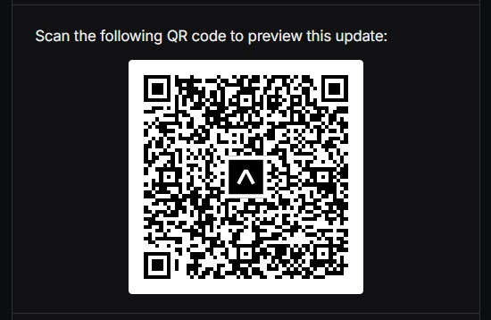

---

## 🧩 Architecture Overview

The app follows a **three-layer architecture** for maintainability and scalability:

1. **Presentation Layer:**
   Contains three primary views — **Authentication (Login/Signup)**, **To-Do List**, and **Details** — handling all UI and presentation logic.

2. **Business Logic Layer:**
   Manages core functionality such as **user signup**, **login**, and **CRUD operations** through custom hooks (`useTodos`).
   It interacts with **AsyncStorage** to persist data locally on the device.

3. **Domain / State Layer:**
   Uses a **global state** to manage session data (e.g., logged-in status) and provide shared access across components.

> 🗄️ Data is stored using a **NoSQL-style structure** within local storage for lightweight persistence.

**Architecture Diagram:**

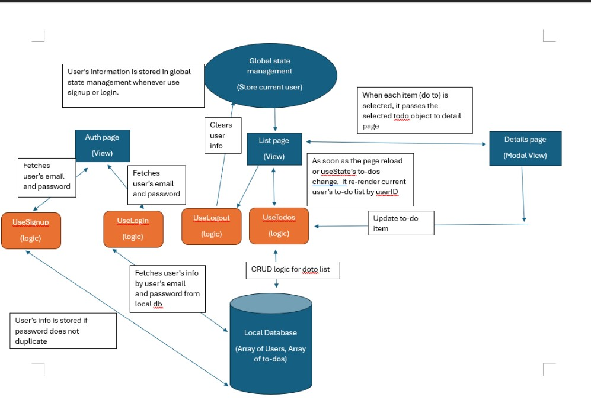

---

## 📸 App Demo Screenshots

### 🔹 1. Login / Signup

Create an account or log in if you already have one.

> Buttons remain disabled (greyed out) until all required fields are entered.

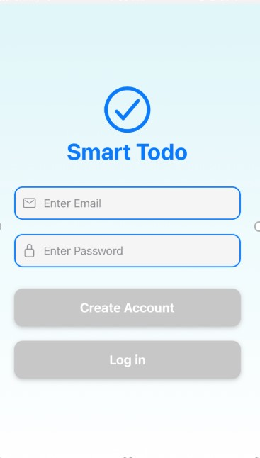

---

### 🔹 2. Email Validation

Emails that do not match the `name@domain.com` format are rejected.
Once valid, the buttons become active.

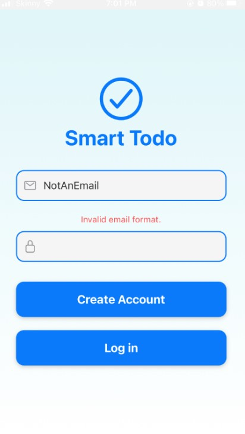

---

### 🔹 3. Password Validation

Passwords must be **at least 6 characters long**.

> iPhone prevents screenshotting password fields for security, so the input is not visible in this image.

---

### 🔹 4. User Validation

The app prevents duplicate account creation and invalid logins.

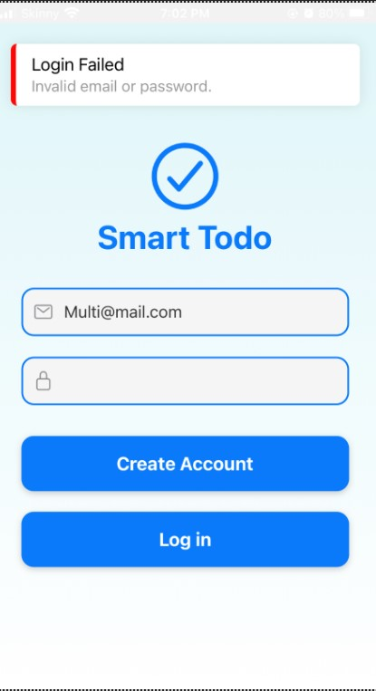

---

### 🔹 5. Main Page

Once logged in, users see their personal **To-Do List dashboard**.

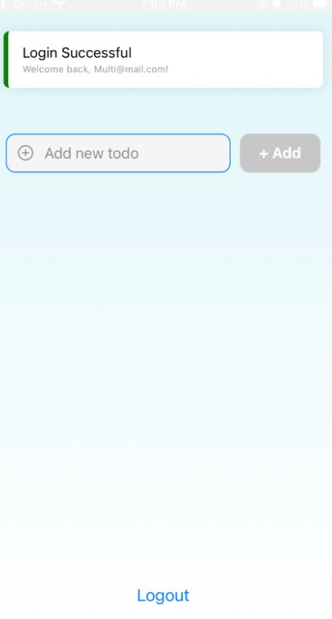

---

### 🔹 6. Creating To-Dos

Typing in the input field automatically enables the **Add** button.

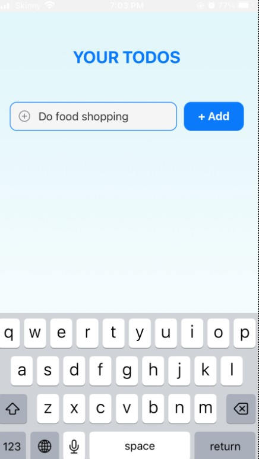

---

### 🔹 7. Storing To-Dos

When the Add button is clicked:

- The to-do is stored and re-fetched from local storage.
- A validation check confirms the data is saved.
- Users can toggle tasks as completed ✅ (also persisted locally).

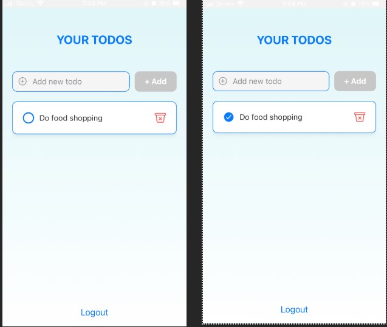

---

### 🔹 8. Updating To-Dos

Tap on any to-do to open a modal and update its content.

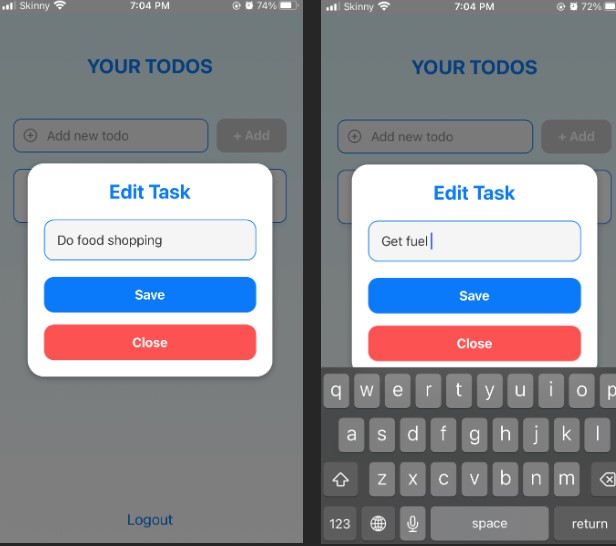

---

### 🔹 9. Deleting To-Dos

Use the 🗑️ **bin icon** to remove a task.
This immediately updates both the UI and local storage.

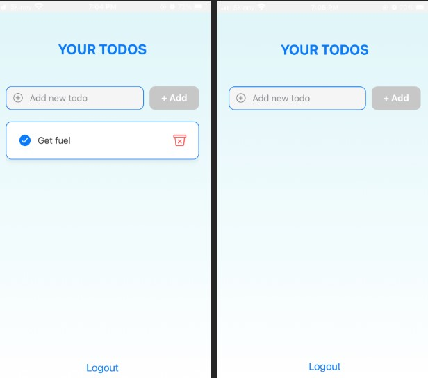

---

### 🔹 10. Data Persistence

To-dos are saved locally.
Even after logging out or closing the app, tasks remain available when you log back in.

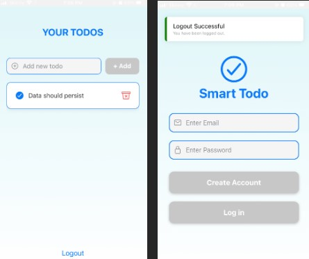
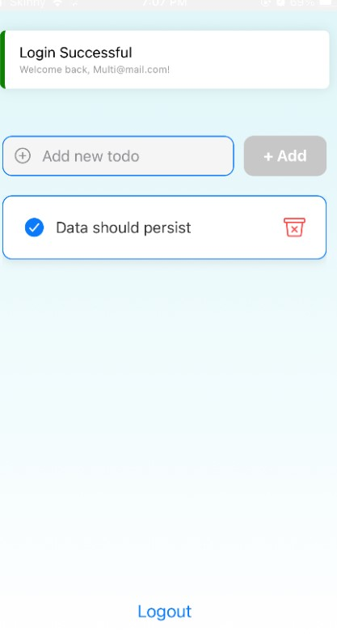

---

### 🔹 11. Unit Tests

Unit tests were written to verify **signup** and **logout** logic, ensuring core functionality works as expected.

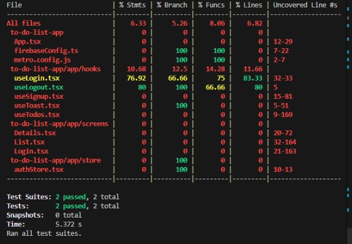

---

## 🧠 Key Features

- ✅ Cross-platform (iOS & Android)
- 🔐 Authentication (Signup / Login)
- 🗂️ Persistent local storage (AsyncStorage)
- ✏️ CRUD functionality for To-Dos
- 🧮 Basic input validation
- 🧪 Unit testing for key logic
- 🧱 Modular architecture for scalability

---

## 👩‍💻 Tech Stack

- **Frontend:** React Native (Expo), TypeScript
- **State Management:** Zustand
- **Storage:** AsyncStorage (NoSQL structure)
- **Testing:** Jest
- **IDE:** Visual Studio Code

---
