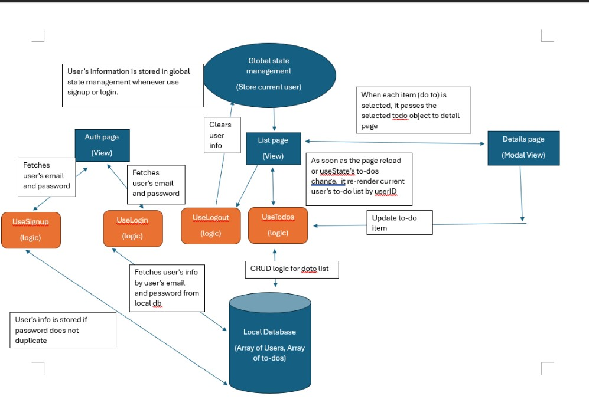
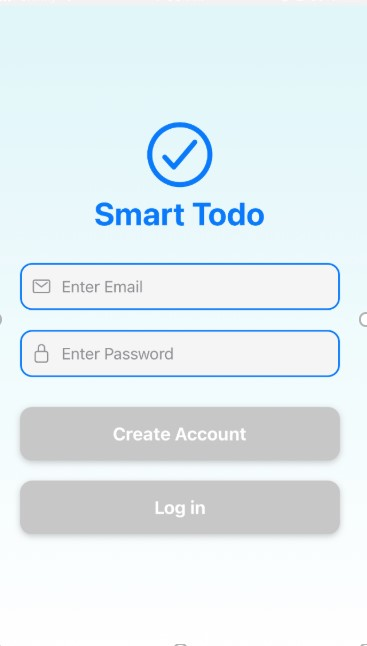
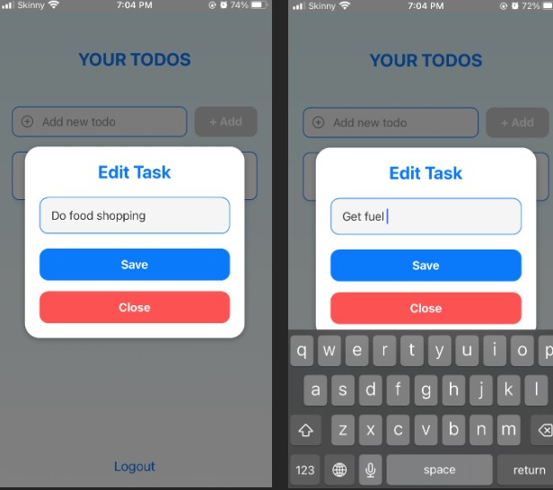
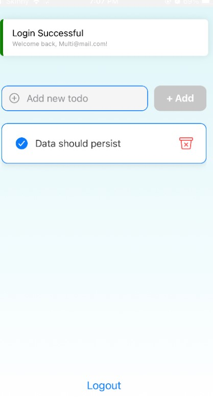

# to-do-list-app

## About

The application is a simple to-do app that runs on iphone and android phones, the code base can also be converted into java and script from typescript.  

## Prerequisites

1. **Install Expo Go (you do no need to register to use the app)**:
   - **iOS**: [Download Expo Go from the App Store](https://apps.apple.com/us/app/expo-go/id982107779).
   - **Android**: [Download Expo Go from Google Play](https://play.google.com/store/apps/details?id=host.exp.exponent). 

## Running the App

1. **How to view the app**:
   - Scan the QR code displayed in the terminal using the **Expo Go** app on your phone or by scanning it with your camera.
     The app hosted live and can be viewed by downloading the **Expo Go** app from your app store and scanning the following QR code below:

[Scan this QR code to view the app](https://expo.dev/preview/update?message=set%20addVersionSource&updateRuntimeVersion=1.1.0&createdAt=2024-12-31T01%3A02%3A09.239Z&slug=exp&projectId=ba97eb8d-f733-4ac9-b817-975a16122842&group=9b10e8b7-47f0-4483-a75c-bbc20d22645e).

### If link is not working can scan here

 

## Archtecture Diagram

The following show cases how we structured our code. We have 3 layers, a presentation layer consisting of 3 views auth (login/signup), todo list, and details view with all presentation logic housed. Our second layer is our business logic that houses signup, login, useTodos which handles all our CRUD logic related to our models stored in local storage using ayscneStores to access devices memory for long term storage. The database uses Nosql. We also have a global state which is a domain that access through out the app for tracking the users session interaction, example if logged in or not.

 

## Demo screen shots

1. **Login/signup**: You can create a user or you can log in if your account already exist.
   - Please note: that the buttons are disabled and greyed out until the user enters their details.

2. **Email validation**:Emails that do not follow name@domain.com format will not be allowed to be entered as seen below. Also the buttons are now enabled allowing users to continue.

3. **Password validation**:
   Simple validation to check length of password (at least 6 charactors).

- Please note: that the password is not displayed in the input due to iPhone security and does not allow for password screen shots when password inputs are detected

4. **User validation**:
   You can not create an account if the account exists already. You can not login if there is no such account as well.

5. **Main page**:
   Once the user has logged in they will be presented with the following screen

6. **Creating todos**:
   Once the user has clicked the text input the button will also be enabled.

7. **Storing todo**:Once the add button is clicked, it will be stored then re-fetched from local storage also executing a validation check to see if it was stored correctly then displayed bellow as a list of todos.

- You can also toggle the tick to show that the todo is complete, this is also updated in local storage for persisting.

8. **Updating todos**:
   If the user clicks the todo a modal pop up will be presented to allow users to update their todos as seen below.

9. **Deleting todos**:
   a bin icon that allows users to delete their todos.

This will then clear the ui and also remove the todo from the todos list of the logged in user.

10. **Deleting todos**:
    As seen bellow, users can add their todos then logout or leave the app completely.

Once the user relaunches the app and logs back in their todo’s will still be viewable, updateable and delectable

11. **Unit tests**:
    tests focused on the logout and sign up logic to test

